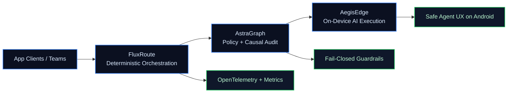

  
  
  
  

  
  
  
  
  

## Featured Now

| Project | Why it is exciting | Build Signal |
| --- | --- | --- |
| **[AegisEdge](https://github.com/yagna-1/AegisEdge)** *(Private)* | Android edge-AI agent with action safety, consent flow, memory, and local/remote inference control. | **Most recent private repo** |
| **[astragraph](https://github.com/yagna-1/astragraph)** | Fail-closed policy enforcement + observability for MCP/A2A multi-agent systems. | 24 stars and active Rust platform direction |
| **[fluxroute](https://github.com/yagna-1/fluxroute)** | Deterministic AI orchestration runtime in Go with replay, metering, and multi-tenant control plane primitives. | **Most recently pushed project** |

## Proof of Impact

- Contributed to the OpenAI SWE-Lancer benchmark, evaluating LLM performance on 1,400+ real engineering tasks.
- Built distributed inference pipelines that can execute 1,000+ tasks in parallel on AWS.
- Improved retrieval quality by ~25% using hybrid search (semantic + BM25) and evaluation-led iteration.

## System Vision

## Highlighted Project Cards

  
  

  

  Private build walkthrough available on request.

## Most Recent Project Wave

- **FluxRoute:** deterministic orchestration runtime for production AI workflows.
- **AegisEdge (private):** edge Android AI agent with safety and execution controls.
- **AstraGraph:** policy-first observability and guardrails for multi-agent traffic.
- **baremetal-infer:** minimal native edge inference runtime.
- **open-finetune-config-os / SchedIQ:** model tuning config tooling and scheduling product work.

## Selected Repos

**Top 6:** [AegisEdge](https://github.com/yagna-1/AegisEdge) (private) • [astragraph](https://github.com/yagna-1/astragraph) • [fluxroute](https://github.com/yagna-1/fluxroute) • [baremetal-infer](https://github.com/yagna-1/baremetal-infer) • [SchedIQ](https://github.com/yagna-1/SchedIQ) • [open-finetune-config-os](https://github.com/yagna-1/open-finetune-config-os)

<b>More repos</b>

 

[Memory-KV-Cache](https://github.com/yagna-1/Memory-KV-Cache) • [Vectorless-RAG](https://github.com/yagna-1/Vectorless-RAG) • [AgentScopeLocal](https://github.com/yagna-1/AgentScopeLocal) • [SouthBridge-ACP-Client](https://github.com/yagna-1/SouthBridge-ACP-Client) • [ace-devops-troubleshooter](https://github.com/yagna-1/ace-devops-troubleshooter) • [NextTokenApp](https://github.com/yagna-1/NextTokenApp) • [NextToken](https://github.com/yagna-1/NextToken) • [AIWatchLite](https://github.com/yagna-1/AIWatchLite) • [code-explainer](https://github.com/yagna-1/code-explainer) • [gentic-document-extractor](https://github.com/yagna-1/gentic-document-extractor) • [RAG-based-QA](https://github.com/yagna-1/RAG-based-QA) • [multi_source_qa](https://github.com/yagna-1/multi_source_qa)

## Build Stack

**Core:** Python, Go, Rust, TypeScript, SQL  
**AI:** PyTorch, TensorFlow, Hugging Face, RAG, LoRA/QLoRA, eval harnesses  
**Infra:** AWS, Docker, Kubernetes, FastAPI, PostgreSQL, ChromaDB, FAISS

## Connect

[Portfolio](https://yagna-1.vercell.app) | [LinkedIn](https://linkedin.com/in/yagna-siva-sai-kumar-984881201/) | [Email](mailto:yagnasivasaikumar@gmail.com)
