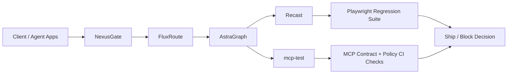

  <strong>Building production-grade agent systems end to end:</strong> 
  route, orchestrate, govern, and test with deterministic execution and safety guardrails.

  
  
  
  

  
  
  
  
  
  

## Executive Summary

I design and ship agent infrastructure that teams can run in production with confidence.

- deterministic orchestration and replay
- policy-first fail-closed enforcement
- workflow-level routing and budget controls
- audit-to-regression-test generation
- MCP contract and policy validation for CI

## AgentStack Platform

The combined reference repository is listed first, followed by the five core platform layers.

| Priority | Repository | Layer | What it contributes |
| --- | --- | --- | --- |
| 1 | **[agentstack-reference](https://github.com/yagna-1/agentstack-reference)** | Platform Glue | Single compose-based reference stack that wires all layers together. |
| 2 | **[nexusgate](https://github.com/yagna-1/nexusgate)** | Route | MCP/LLM ingress, provider fallback, workflow-aware spend governance. |
| 3 | **[fluxroute](https://github.com/yagna-1/fluxroute)** | Orchestrate | Deterministic DAG runtime, replay semantics, tenant-aware control-plane primitives. |
| 4 | **[astragraph](https://github.com/yagna-1/astragraph)** | Govern | Fail-closed policy enforcement and causal audit graph for MCP/A2A actions. |
| 5 | **[recast](https://github.com/yagna-1/recast)** | Test (Agent) | Compiles production traces/audit logs into static Playwright suites. |
| 6 | **[mcp-test](https://github.com/yagna-1/mcp-test)** | Test (MCP) | MCP client/test harness with policy assertion helpers for CI gates. |

## Architecture Snapshot

```mermaid
flowchart LR
    A[Client / Agent Apps] --> B[NexusGate]
    B --> C[FluxRoute]
    C --> D[AstraGraph]
    D --> E[Recast]
    D --> F[mcp-test]
    E --> G[Playwright Regression Suite]
    F --> H[MCP Contract + Policy CI Checks]
    G --> I[Ship / Block Decision]
    H --> I
```

## Current Focus

- hardening the AgentStack reference path for faster onboarding and reproducible demos
- strengthening the AstraGraph -> Recast regression loop
- making policy + contract checks first-class in CI with `mcp-test`

## Highlighted Repositories

  
  

  
  

  
  

## Proof of Engineering Impact

- Contributed to the OpenAI SWE-Lancer benchmark ecosystem, evaluating LLMs on large-scale real engineering tasks.
- Built distributed inference workloads executing 1,000+ parallel tasks on AWS.
- Improved retrieval performance by roughly 25% through hybrid retrieval and evaluation-led iteration.

## Research

- [SWE-Lancer (arXiv)](https://arxiv.org/abs/2502.12115)

## Technical Focus

| Area | Tools |
| --- | --- |
| Languages | Python, Go, Rust, TypeScript, SQL |
| AI/ML | PyTorch, TensorFlow, Hugging Face, RAG, LoRA/QLoRA, eval harnesses |
| Infra | AWS, Docker, Kubernetes, FastAPI, PostgreSQL, ChromaDB, FAISS |
| Observability & Runtime | OpenTelemetry, Prometheus, replay traces, policy telemetry |

## Connect

- Portfolio: [yagna-1.vercell.app](https://yagna-1.vercell.app)
- LinkedIn: [yagna-siva-sai-kumar](https://linkedin.com/in/yagna-siva-sai-kumar-984881201/)
- Email: [yagnasivasaikumar@gmail.com](mailto:yagnasivasaikumar@gmail.com)
